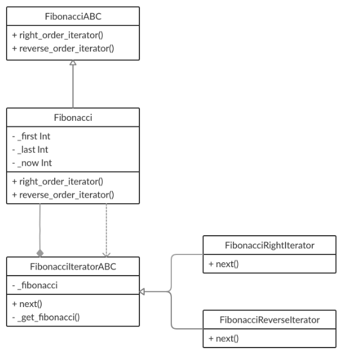

# fibonacci-iterator

## [OTUS](https://otus.ru) homework

### Goal
Implement OOP pattern **Iterator**

### Description
This program can do fibonacci sequence iteration up and down.

### Class schema


### Iterator
There is a state in the object of class **Fibonacci**. This object can return two
**FibonacciIteratorABC** objects which have an access to **Fibonacci** object class state.
This iterator objects have method **next()** returning next or previous value of fibonacci sequence.
```python
fib = Fibonacci(first=8, last=16)
right_iterator = fib.right_order_iterator()
reverse_iterator = fib.reverse_order_iterator()

right_iterator.next() # 34
right_iterator.next() # 55
right_iterator.next() # 89

reverse_iterator.next() # 55
reverse_iterator.next() # 34
reverse_iterator.next() # 21

reverse_iterator.next() # StopIteration: Lower bound of the sequence.
```

To run program:
```bash
$ python start.py
```

To run tests:
```bash
$ python -m unittest tests
```